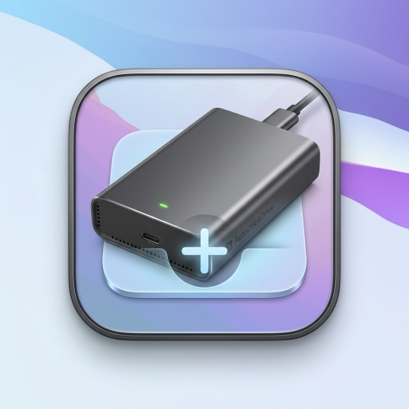

<div align="center">
  
  <h1>AutoDockDrive</h1>
  <p><b>A native, lightweight macOS utility that automatically manages your external drives right in your Dock.</b></p>
  
  <p>
    <a href="https://github.com/willyhay22/AutoDockDrive/releases/latest">
      
    </a>
    
    
    <a href="LICENSE">
      
    </a>
  </p>
</div>

---

AutoDockDrive functions completely invisibly, dynamically adding your external hard drives, SD cards, and USB thumb drives to your Dock as soon as they are connected, and perfectly removing them when they are safely ejected.

It feels like a feature that should have shipped with macOS—simple, elegant, reliable, and entirely unobtrusive.

## ✨ Features

* **Instant Recognition:** Automatically identifies removable hardware volumes and places a shortcut on the right side of your Dock.
* **Smart Filtering:** Powered by Apple's low-level `DiskArbitration` framework. It explicitly ignores virtual drives, temporary app installers (`.dmg`), and Time Machine backup drives to keep your Dock pristine.
* **Auto Cleanup:** Automatically removes the shortcut immediately upon ejecting or unmounting the drive to prevent dead links.
* **Custom Appearance:** Tailor exactly how drives appear when added! Defaulting to *Folder* display, sorted by *Date Modified*, and viewed as a *List*.
* **Menu Bar Integration:** A lightweight menu bar app gives you quick access to pause management, adjust preferences, or immediately open connected drives.
* **Native Welcome Experience:** A polished setup screen on first launch allows you to effortlessly configure your preferences.
* **Launch at Login:** Seamlessly integrates with macOS `SMAppService` to start silently in the background when you boot up.
* **No Fragile Hacks:** Modifies your Dock using safe, atomic `defaults import / export` architecture to guarantee synchronization with macOS's internal `cfprefsd`.

## 📥 Installation

1. Navigate to the [Releases page](../../releases/latest).
2. Download the latest **`AutoDockDrive-1.0.dmg`** file.
3. Open the downloaded `.dmg` file.
4. Drag the **AutoDockDrive** application into your Applications folder.
5. Launch the app from your Applications folder.

*(Note: Because this is an open-source utility not distributed via the Mac App Store, macOS Gatekeeper may block the first launch. Simply **Right-Click** or **Control-Click** the application and select **Open** to bypass this safely.)*

## 🛠️ Building from Source

To compile and build AutoDockDrive yourself (no Xcode required!):

```bash
git clone https://github.com/willyhay22/AutoDockDrive.git
cd AutoDockDrive
./build.sh
```

The build script automatically compiles the Swift source files into a `.app` bundle, ad-hoc signs it, and packages it perfectly into a standard `.dmg` image located inside the `build/` directory.

## 📋 Requirements

* macOS 12.0 Monterey or later.
* Apple Silicon (M1/M2/M3) or Intel processor (Universal Binary).

## 🗑️ Uninstallation

To completely remove AutoDockDrive from your system:

1. Quit the application from the menu bar.
2. Delete `AutoDockDrive.app` from `/Applications`.
3. *(Optional)* Run `defaults delete com.wihay.AutoDockDrive` in your Terminal to clear your saved preferences.

## 📜 License

This project is licensed under the MIT License. See the [LICENSE](LICENSE) file for details.
